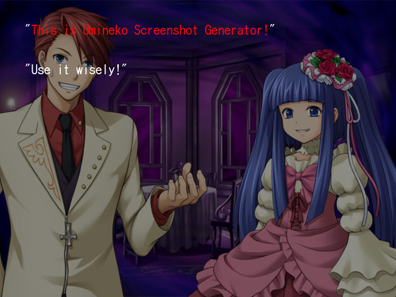

# Umineko Screenshot Generator PS3

This is a tool to generate Umineko screenshots with the PS3 sprites and backgrounds.



### How to use

Just open the `index.html` file in your browser, and pick the background and sprites you want to use. You can also change the text color and the text position.

For colored texts, you can use the following syntax:

```
[red]This text is red[/red]
[blue]This text is blue[/blue]
[golden]This text is golden[/golden]
```